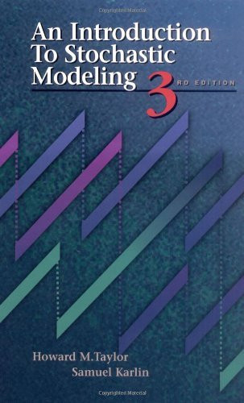
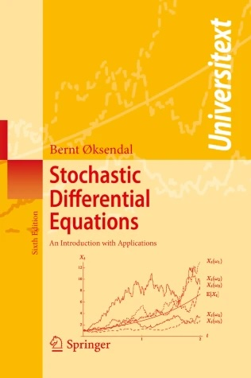

```{r, eval = TRUE, echo=FALSE, prompt=TRUE, tidy=TRUE, collapse=TRUE}
options(digits=4)
```

```{r setup, include=FALSE}
knitr::opts_chunk$set(echo = TRUE)
library(knitr)
library(kableExtra)
```


#  {.unnumbered} 

```{r fig200, echo = FALSE, fig.align = 'center', out.width = '40%'}
knitr::include_graphics("figures/iseg.png")
```

$\,$

$\,$

$\,$

$\,$

$\,$

**This document is not intended to substitute the recommended textbooks.**

$\,$

All errors and omissions are entirely my own.

$\,$


Thanks!

Nuno M. Brites

[nbrites\@iseg.ulisboa.pt](mailto:nbrites@iseg.ulisboa.pt){.email}


\vfill

$\,$

$\,$

$\,$

$\,$

**All rights reserved. Reproduction, copying, distribution, public communication, transformation or any other form of use, in whole or in part, of the contents of this site, including text, code and images, without prior written authorisation from the author is strictly prohibited. Any unauthorised use constitutes a breach of copyright and may give rise to civil and criminal liability under applicable law.**

2025 \| Nuno M. Brites \|
[nbrites\@iseg.ulisboa.pt](mailto:nbrites@iseg.ulisboa.pt){.email}


# Introduction to Stochastic Processes {#intro-stoch-proc}

## Fundamental Concepts {#conceitos-fundamentais}

This section provides a brief review of basic concepts in probability theory and random variables. We then introduce the notion of a *stochastic process*, understood as a family of random variables defined on a probability space and indexed by a parameter set, typically interpreted as time. Finally, we examine some fundamental classes of stochastic processes, in particular those with independent and stationary increments, as well as strictly and weakly stationary processes.

The **sample space** is denoted by $\Omega$ and represents the set of all possible outcomes of a random experiment. Throughout this section, we assume that $\Omega$ is a non-empty set.

$\,$

::: {.definition name="Sigma-algebra"}
A $\sigma$-algebra is a collection $\mathcal{F}$ of subsets of $\Omega$ satisfying the following properties:

1. $\emptyset \in \mathcal{F}$ and $\Omega \in \mathcal{F}$;

2. If $A \in \mathcal{F}$, then $A^c \in \mathcal{F}$, where $A^c$ denotes the complement of $A$ with respect to $\Omega$;

3. If $A_n \in \mathcal{F}$ for all $n \in \mathbb{N}$ and the sets are countable, then  
   $$
   \bigcup_{n \in \mathbb{N}} A_n \in \mathcal{F}.
   $$

The elements of $\mathcal{F}$ are called measurable sets (or $\mathcal{F}$-measurable sets to specify the underlying $\sigma$-algebra).
:::

$\,$

::: {.definition name="Probability Measure"}
A **probability measure** $P$ on the $\sigma$-algebra $\mathcal{F}$ is a function  
$$
P: \mathcal{F} \rightarrow [0, 1]
$$  
satisfying the following properties:

1. $P(\emptyset) = 0$;

2. $P(\Omega) = 1$;

3. If $(A_n)_{n \in \mathbb{N}}$ is a sequence of pairwise disjoint sets in $\mathcal{F}$, then  
   $$
   P\left(\bigcup_{n \in \mathbb{N}} A_n\right) = \sum_{n \in \mathbb{N}} P(A_n).
   $$
:::

$\,$

::: {.definition name="Probability Space"}
A **probability space** is a triple $(\Omega, \mathcal{F}, P),$ where:

- $\Omega$ is a set (the sample space),
- $\mathcal{F}$ is a $\sigma$-algebra on $\Omega$,
- $P$ is a probability measure on $\mathcal{F}$.

The elements of $\mathcal{F}$ are called **events**. For any $A \in \mathcal{F}$, the value $P(A)$ represents the probability of the event $A$.
:::

$\,$

::: {.definition name="Borel Sigma-algebra"}
A **Borel $\sigma$-algebra**, denoted $\mathcal{B}$, defined on a set $E$, satisfies the following properties:

- $\emptyset \in \mathcal{B}$ and $E \in \mathcal{B}$;

- $\mathcal{B}$ is closed under complementation: for all $A \in \mathcal{B}$, we have $A^c \in \mathcal{B}$;

- $\mathcal{B}$ is closed under countable unions: if $A_i \in \mathcal{B}$ for all $i \in \mathbb{N}$, then  
  $$
  \bigcup\limits_{i \in \mathbb{N}} A_i \in \mathcal{B}.
  $$

A Borel $\sigma$-algebra is a specific example of a $\sigma$-algebra and is typically associated with the open sets of $E$. The most common Borel $\sigma$-algebra is the one on $\mathbb{R}$, denoted by $\mathcal{B}_{\mathbb{R}}$, or simply $\mathcal{B}$ when there is no ambiguity.
:::

$\,$

::: {.definition name="Random Variable"}
Let $(\Omega, \mathcal{F}, P)$ be a probability space. A function  
$$
X: \Omega \rightarrow \mathbb{R}
$$  
is said to be a **random variable (r.v.)** if  
$$
\forall ~ B \in \mathcal{B}: X^{-1}(B) \in \mathcal{F},
$$  
where $\mathcal{B}$ denotes the Borel $\sigma$-algebra on $\mathbb{R}$.

In addition, we say that $X$ is **$\mathcal{F}$-measurable**, or simply **measurable** when the $\sigma$-algebra is understood from context.

```{tikz, fig0, echo=FALSE, fig.align = 'center', out.width = '60%'}
\begin{tikzpicture}[thick,>=stealth]

% Caixa para Omega
\draw[fill=blue!20,draw=blue,thick] (0,0) rectangle (3,4);
\node at (1.5,3.6) {$(\Omega, \mathcal{F})$};

% Caixa para R
\draw[fill=green!20,draw=green,thick] (6,0) rectangle (9,4);
\node at (7.5,3.6) {$(\mathbf{R}, \mathcal{B})$};

% Seta X
\draw[->,thick] (3,2) -- (6,2) node[midway,above] {$X$};

% Conjunto B em R
\draw[fill=green!70!black,opacity=0.6] (7.5,1.5) circle (0.75);
\node[white] at (7.5,1.5) {$B$};

% Pre-imagem X^{-1}(B) em Omega
\draw[fill=blue!70!black,opacity=0.6] (1.5,1.5) circle (0.75);
\node[white] at (1.5,1.5) {$X^{-1}(B)$};

\end{tikzpicture}
```
:::

$\,$

::: {.theorem}
Let $X: \Omega \to \mathbb{R}$ be a random variable. Define
$$
\sigma(X) = \{ X^{-1}(B) : B \in \mathcal{B} \}.
$$
Then, $\sigma(X)$ is the smallest $\sigma$-algebra on $\Omega$ with respect to which $X$ is measurable. This $\sigma$-algebra, which is contained in $\mathcal{F}$, is called the **$\sigma$-algebra generated by $X$**.
:::

$\,$

::: {.definition name="Mean and Variance"}
Let $(\Omega, \mathcal{F}, P)$ be a probability space, and let $X: \Omega \rightarrow \mathbb{R}$ be a random variable. The **expected value** (or **mean**) and the **variance** of $X$ are defined as follows:

**1. General case (with probability measure $P$):**
\[
E(X) = \int_\Omega X \, dP, \quad 
\operatorname{Var}(X) = \int_\Omega (X - E(X))^2 \, dP,
\]
provided these integrals exist and are finite.

**2. Discrete case:**  
If $X$ takes values in a discrete set $\{x_1, x_2, \dots\}$ with probabilities $p_i = P(X = x_i)$, then
\[
E(X) = \sum_i x_i \, p_i, \quad 
\operatorname{Var}(X) = \sum_i (x_i - E(X))^2 \, p_i.
\]

**3. Continuous case:**  
If $X$ has a probability density function $f_X(x)$ with respect to the Lebesgue measure, then
\[
E(X) = \int_{-\infty}^{+\infty} x f_X(x) \, dx, \quad 
\operatorname{Var}(X) = \int_{-\infty}^{+\infty} (x - E(X))^2 f_X(x) \, dx.
\]
:::

$\,$

::: {.definition}
Let $(\Omega, \mathcal{F}, P)$ be a probability space, and let $X$ be a random variable defined on this space.

1. $X$ is said to be a **square-integrable random variable** if  
   $$
   E(X^2) < +\infty;
   $$

2. The space **$L^2$** is the set of all square-integrable random variables defined on $(\Omega, \mathcal{F}, P)$;

3. The **$L^2$ norm** is defined by
   $$
   \forall ~ X \in L^2:~ \|X\|_{L^2} = \left(E(X^2)\right)^{1/2}.
   $$
:::

$\,$

::: {.definition}
Let $(X_n : n \in \mathbb{N})$ be a sequence of random variables in $L^2$. We say that $(X_n)$ **converges to $X$ in $L^2$** if
$$
\|X_n - X\|_{L^2} \rightarrow 0 \quad \text{as} \quad n \to +\infty,
$$
or, equivalently,
$$
E\left((X_n - X)^2\right) \to 0 \quad \text{as} \quad n \to +\infty.
$$

This type of convergence is called **mean square convergence**, and it is denoted by
$$
X_n \xrightarrow{m.s.} X \quad \text{as} \quad n \to +\infty,
$$
or
$$
\mathop{l.i.m.}\limits_{n \to +\infty} X_n = X.
$$
:::
$\,$

::: {.definition}
Let $X$ be a random variable and let $(X_n : n \in \mathbb{N})$ be a sequence of random variables defined on the probability space $(\Omega, \mathcal{F}, P)$.

1. We say that $X_n$ **converges almost surely** (a.s.) to $X$, or that it **converges with probability 1**, denoted by  
   $$
   X_n \xrightarrow{a.s.} X \quad \text{or} \quad \lim_{n \to +\infty} X_n = X \quad \text{a.s.},
   $$  
   if $X_n(\omega) \to X(\omega)$ for all $\omega \in \Omega \setminus N$, where $N \in \mathcal{F}$ is a null set, i.e., $P(N) = 0$.

2. We say that $X_n$ **converges in probability** (or **stochastically**) to $X$, denoted by  
   $$
   X_n \xrightarrow{P} X \quad \text{or} \quad P\text{-}\lim_{n \to +\infty} X_n = X,
   $$  
   if, for every $\delta > 0$,  
   $$
   P(|X_n - X| > \delta) \to 0 \quad \text{as} \quad n \to +\infty.
   $$
:::

$\,$

When studying phenomena that exhibit no temporal evolution, one typically uses **random samples** — that is, repetitions of i.i.d. observations (independent and identically distributed).  

But what if we are dealing with **random variables** that have already been observed (or could have been) in the past and may be observed again in the future?

This is the case, for example, when studying:

- the daily price of a stock on the financial market;

- the evolution of the unemployment rate over a given period;

- the number of people arriving at a certain queue to be served;

- the temperature over time at a specific location;

- $\ldots$

In such cases, we typically have only a **single realisation** (called a **trajectory** or **sample path**) from which we seek to draw conclusions.  

In this trajectory, observations are no longer independent.  

Typical objectives include:

- forecasting future values;

- identifying the nature of the underlying evolution;

- filtering (i.e., prediction using partial observations).

$\,$

::: {.definition name="Stochastic Process"}
A **stochastic process** (SP) is a family of random variables $\{X_t, ~t \in T\}$ defined on the same probability space $(\Omega, \mathcal{F}, P)$ and taking values in the same measurable space $(E, \mathcal{B})$, where:

- $T$: parameter space (or time);

- $\Omega$: sample space;

- $\mathcal{F}$: $\sigma$-algebra defined on $\Omega$;

- $P$: probability measure;

- $E$: state space (values taken by $X$);

- $\mathcal{B}$: Borel $\sigma$-algebra defined on $E$.
:::

$\,$

::: {.remark}
- Given a probability space $(\Omega, \mathcal{F}, P)$ and an arbitrary set $T$, a SP is a function $X(t,\omega)$ defined on $T \times \Omega$, such that for each $t \in T$, $X_t(\omega)$ is a random variable.

- The concept of SP generalises that of a random variable by making it depend on a parameter $t$ with domain $T$. Thus, a SP can be interpreted as an ordered family of random variables.

- For each fixed $\omega_0 \in \Omega$, $X(\omega_0, t)$ is a non-random function of $t$. In this way, a SP can be identified with a system that assigns to each point $\omega \in \Omega$ a function of the parameter $t$. Each of these functions is called a **trajectory** or **realisation** of the process $X$.
:::

$\,$

::: {.definition name="Trajectory of a stochastic process"}
The **trajectory** or **realisation** of a stochastic process $X$ is the collection
$$
\{X_t(\omega), ~ t \in T\}, \quad \forall ~ \omega \in \Omega.
$$
:::

$\,$

::: {.remark}
In general, $(E, \mathcal{B}) = (\mathbb{R}^n, \mathcal{B}_{\mathbb{R}^n})$, where:

- $\mathbb{R}^n$: the set of possible values of the process $X_t$;

- $\mathcal{B}_{\mathbb{R}^n}$: the Borel $\sigma$-algebra on $\mathbb{R}^n$;

- If $n=1$, the SP is called a **univariate stochastic process**;

- If $n > 1$, the SP is called a **multivariate stochastic process**;

- $t$: the instant at which the observation is made or the time period relative to that observation;

- If $E$ is finite or countably infinite, then $X$ is a **discrete state space stochastic process**;

- If $E = \mathbb{R}$, then $X$ is a **real-valued stochastic process**;

- If $T$ is finite or countably infinite, then $X$ is a **discrete time stochastic process** (typically $T = \mathbb{N}_0$ or $T = \mathbb{Z}$);

- If $T$ is uncountably infinite, then $X$ is a **continuous time stochastic process** (typically $T = \mathbb{R}^+_0$ or $T = \mathbb{R}$).
:::

$\,$

Below is an example of a trajectory of a stochastic process:

```{r simulacao-movimento-browniano, echo=FALSE, fig.width=7, fig.height=4}
set.seed(123)  # para reprodutibilidade

# Parâmetros {#parametros}
T <- 1        # tempo total
n <- 500      # número de passos
dt <- T / n   # tamanho do passo

# Simulação do Movimento Browniano {#simulacao-do-movimento-browniano}
increments <- rnorm(n, mean = 0, sd = sqrt(dt))  # incrementos independentes N(0, dt)
W <- c(0, cumsum(increments))                    # percurso do processo (começa em 0)
time <- seq(0, T, length.out = n + 1)

# Plot {#plot}
plot(time, W, type = "l", col = "blue", lwd = 2,
     xlab = "Time", ylab = expression(X(t)))
grid()
```

$\,$
  
::: {.exercise}
For each of the following stochastic processes, indicate the parameter space and the state space:

(a) Let $X_i$ be the amount of beer (in litres) ordered by the $i$-th customer entering a bar, and let $N(t)$ be the number of customers who have arrived at the bar by time $t$. The stochastic process is
$$
Z_t = \sum\limits_{i=1}^{N(t)} X_i, \quad t \geq 0,
$$
where $Z_t$ represents the total amount of beer ordered up to time $t$.

(b) A baby sleeps in one of three positions: (i) lying on their back with a radiant expression; (ii) curled up in the fetal position; (iii) in the fetal position sucking their thumb. Let $X_t$ be the baby's sleeping position at time $t$. The process is $(X_t: \quad t \geq 0)$.

(c) Let $X_n$ be the state (on or off) of an office photocopier at noon on the $n$-th day. The process is $(X_n: \quad n = 1, 2, \dots)$.
:::


## Classical types of stochastic processes {#tipos-classicos-de-processos-estocasticos}

### Processes with independent and stationary increments {#processos-de-incrementos-independentes-e-estacionarios}

::: {.definition name="Process with independent increments"}
$\{X_t, ~ t \in T\}$ is a stochastic process with **independent increments** if and only if
$$
\forall ~ n \in \mathbb{N}, \forall ~ t_1, \ldots, t_n \in T: ~ t_1 < t_2 < \ldots < t_n \implies X_{t_2} - X_{t_1}, X_{t_3} - X_{t_2}, \ldots, X_{t_n} - X_{t_{n-1}}
$$
are mutually independent random variables.
:::

$\,$

::: {.definition name="Process with stationary increments"}
$\{X_t, ~ t \in T\}$ has **stationary increments** if and only if for all $s, t \in T$, with $s < t,$ the distribution of $X_t - X_s$ depends only on the length $t - s$.
:::

$\,$

::: {.remark}
In a stochastic process with stationary increments, the distribution of $X_{t_1 + h} - X_{t_1}$ is the same as that of
$X_{t_2 + h} - X_{t_2}$, for all $t_1, t_2 \in T$ and for all $h \in \mathbb{R}_0^+$ such that $t_1 + h, t_2 + h \in T$.
:::


$\,$

::: {.definition name="Process with independent and stationary increments"}
Given a stochastic process (SP) $X := \{X_t, ~ t \in T\}$, where $T$ is equipped with an order relation, $X$ is a process with **independent and stationary increments** if and only if it has independent increments and stationary increments.
:::

### Real Second-Order Stochastic Process {#real-second-order-stochastic-process}

::: {.definition name="Gaussian Process"}

A stochastic process $\{X_t, ~t \in T\}$ is called a **Gaussian Process** if
\[
\forall ~n \in \mathbb{N},~ \forall ~t_1, \ldots, t_n \in T, \quad (X_{t_1}, X_{t_2}, \ldots, X_{t_n}) \sim \mathcal{N}_n(\mu, \Sigma),
\]
that is, any finite vector of random variables from the process has a multivariate normal distribution.
:::

$\,$

::: {.definition name="Real Second-Order Stochastic Process"}
A stochastic process $\{X_t, ~ t \in T\}$ is called a **real second-order stochastic process** if, and only if,
$$
\forall ~t \in T: \; E\!\left(X_t^2\right) < +\infty.
$$
:::

$\,$

::: {.example name="Gaussian White Noise"}
A **Gaussian White Noise** process $\{\varepsilon_t, ~t \in T\}$ is defined as a stochastic process that satisfies:

- $\forall ~t \in T, ~E(\varepsilon_t)=0$;

- $\forall ~t \in T, ~\mathrm{Var}(\varepsilon_t)=\sigma^2$;

- $\forall ~s, t \in T, s \neq t, ~\mathrm{Cov}(\varepsilon_s,\varepsilon_t)=0$;

- $\forall ~n \in \mathbb{N}, \forall ~t_1, t_2, \ldots, t_n \in T$, the vector $(\varepsilon_{t_1}, \varepsilon_{t_2}, \ldots, \varepsilon_{t_n})$ is Gaussian.
:::

### Stationary Processes {#stationary-processes}

::: {.definition name="Strictly Stationary Process"}
A stochastic process $\{X_t,~ t \in T\}$ is said to be **strictly stationary** (or strongly stationary) if:
$$
\forall~n \in \mathbb{N},~ \forall~t_1, \ldots, t_n \in T,~ \forall~h \in \mathbb{R} \text{ such that } t_1 + h, \ldots, t_n + h \in T,
$$
$$
(X_{t_1}, \ldots, X_{t_n}) \stackrel{d}{=} (X_{t_1+h}, \ldots, X_{t_n+h}),
$$
that is, the joint distribution of any finite vector of random variables of the process is invariant under time shift.
:::

As a consequence of strict stationarity, we have the following theorem:

::: theorem
If $\{X_t, t \in T\}$ is a second-order stochastic process and is strictly stationary, then:

-   $E(X_t) = m$, that is, the mean of the process is independent of $t$;

-   $\forall ~h \in T, ~ \Gamma(t,t+h) = \operatorname{Cov}(X_t, X_{t+h}) = \operatorname{Cov}(X_0, X_h) = \gamma(h)$,
    independent of $t$.
:::

$\,$

::: {.definition name="Weakly Stationary Process"}
A stochastic process $\{X_t, t \in T\}$ is **weakly stationary** (or second-order stationary) if and only if:

- $\forall ~t \in T, ~ E(X_t^2) < +\infty$;

- $\forall ~t \in T, ~ E(X_t) = m$, independent of $t$;

- $\forall ~t \in T, \forall ~h \in T, ~ \operatorname{Cov}(X_t, X_{t+h}) = \gamma(h)$, i.e., the covariance depends only on $h$.
:::


$\,$

::: {.remark}
The function $\gamma(h), ~ \forall ~ h \in T$, is called the **autocovariance function**. If $h=0$, then 
$$
\operatorname{Cov}(X_t, X_{t+h}) = \operatorname{Var}(X_t) = \gamma(0), \quad \forall ~ t \in T.
$$ 
This property is called **homoscedasticity**.
:::

$\,$

Now, let's see that White Noise, $\{\varepsilon_t, ~ t \in T\}$, is an example of a second-order stationary stochastic process:

::: {.example}
-   $E(\varepsilon_t) = 0$;

-   $Var(\varepsilon_t) = \sigma^2 \implies E(\varepsilon_t^2) < + \infty$;

-   For $t \neq s$, $Cov(\varepsilon_s, \varepsilon_t) = 0 \implies$ independence between $t$ and $s$.

Thus,

$$
\gamma(h) = 
\begin{cases}
\sigma^2, & h = 0, \\
0, & h \neq 0.
\end{cases}
$$

Hence, the conditions for weak stationarity are satisfied.
:::

$\,$

::: {.remark name="Important remark"}
$$\text{Strong stationarity} + E(X_t^2) < +\infty \Rightarrow \text{Weak stationarity}.$$
$$\text{Weak stationarity} \nRightarrow \text{Strong stationarity}.$$
:::

$\,$

::: {.example}
Consider the stochastic process $(X_t, ~ t \in \mathbb{N})$ where $X_t$ has a Cauchy distribution, i.e., with probability density function
$$
f(x) = \frac{1}{\pi(1 + x^2)}.
$$
Since $E(X_t)$ does not exist, then $E(X_t^2)$ is not defined. Thus, the process is strongly stationary but not weakly stationary.
:::

$\,$

::: {.definition name="Autocorrelation function in stationary processes"}
Let $\{X_t, ~ t \in T\}$ be a stationary stochastic process. The **autocorrelation function** $\rho$ is defined by:
$$
\rho(h) = Corr(X_t, X_{t+h}) = \frac{Cov(X_t, X_{t+h})}{\sqrt{Var(X_t)} \sqrt{Var(X_{t+h})}} = \frac{\gamma(h)}{\gamma(0)}.
$$
:::

$\,$

::: {.exercise}
Let $X$ and $Y$ be two random variables with zero mean, uncorrelated, and with the same variance $\sigma^2 > 0$. Consider the stochastic process $(Z_t: ~ t \in \mathbb{Z})$ defined by:

$$
Z_t = f(t) \cdot X + g(t) \cdot Y, \quad t \in \mathbb{Z},
$$

where $f$ and $g$ are deterministic functions.

(a) Find expressions for $f$ and $g$ so that the process $(Z_t: ~ t \in \mathbb{Z})$ has constant variance but is not necessarily weakly stationary.

(b) Specify $f$ and $g$ such that $(Z_t: ~ t \in \mathbb{Z})$ is weakly stationary.
:::

$\,$

::: {.exercise}
Let $\varepsilon = (\varepsilon_t: ~ t \in \mathbb{Z})$ be a white noise process with variance $\sigma^2 > 0$. Consider the stochastic processes $X = (X_t: ~ t \in \mathbb{Z})$ and $Y = (Y_t: ~ t \in \mathbb{Z})$ defined by:

$$
X_t = \varepsilon_t \quad \text{and} \quad Y_t = (-1)^t \varepsilon_t, \quad \forall ~ t \in \mathbb{Z}.
$$

(a) Prove that $X$ and $Y$ are weakly stationary.

(b) Show that the process $(Z_t = X_t + Y_t: ~ t \in \mathbb{Z})$ is a non-stationary process.
:::


$\,$

::: {.exercise}
Consider a stochastic process $Y = (Y_t: t \in \mathbb{Z})$ such that 
$$Y_t = \varepsilon_t - \theta \varepsilon_{t-1}, \quad \theta \in [-1,1],$$
where $(\varepsilon_t: t \in \mathbb{Z})$ is a Gaussian white noise with variance $\sigma^2 > 0$.

(a) Show that $Y$ is Gaussian.

(b) Determine the distribution of the random variable $Y_t$, for all $t \in \mathbb{Z}$.

(c) Determine the autocorrelation function of $Y$.

(d) What can you conclude about the strong and weak stationarity of $Y$?
:::

$\,$

::: {.exercise}
Let $X = (X_t: ~ t \geq 0)$ be a stochastic process defined on the probability space $(\Omega, \mathcal{F}, P)$ such that, for every $t \geq 0$, $X_t \sim \mathcal{N}(0, t)$ and $P(X_0 = 0) = 1$.

(a) Under what conditions is $X$ a process with independent and stationary increments?

(b) Assuming $X$ is a process with independent and stationary increments, show that: 

(i) For all $t, s \in [0,+\infty)$ with $t > s$, it holds that 
$$X_t - X_s \sim \mathcal{N}(0, |t - s|);$$ 

(ii) $X$ is a centered Gaussian process.

(c) Consider the stochastic process $Y = (Y_t: t \geq 0)$ defined by:
$$
Y(t) = 
\begin{cases}
t, & \text{if } X_t \geq 0, \\
-t, & \text{if } X_t < 0.
\end{cases}
$$
Show that $Y$ is a centered second-order stochastic process. Is $Y$ stationary in any sense? Justify your answer.
:::


$\,$

::: {.exercise}
Let $X = (X_t: ~t \in \mathbb{Z})$ and $(\varepsilon_t: ~t \in \mathbb{Z})$ be two stochastic processes defined on the probability space \( (\Omega, \mathcal{F}, P) \), such that:
$$
\forall ~t \in \mathbb{Z}, \quad X_t = \sum\limits_{j=0}^{+\infty} \left( \frac{4}{5} \right)^j \varepsilon_{t-j}.
$$

(a) Explain under which conditions $\varepsilon$ is a white noise.

(b) Suppose that $\varepsilon$ is a white noise such that $E[\varepsilon_t^2] = 9/50$. 

(i) Prove that $X$ is weakly stationary and indicate the corresponding mean function and autocovariance function; 

(ii) Now suppose that $X$ is a Gaussian process. Specify the distribution of the random vector $(X_t, X_s), ~ \forall ~ t, s \in \mathbb{Z}$.

(c) Consider the stochastic process $Y = (Y_t: t \in \mathbb{Z})$ defined by:
$$
Y_t = 
\begin{cases}
\frac{1}{2}, & \text{if } X_t \geq 0, \\
-1, & \text{if } X_t < 0,
\end{cases}
$$
assuming that $X$ satisfies the conditions in item (b) ii). Calculate the mean function of $Y$ and show that $Y$ is weakly stationary.
:::


$\,$

::: {.exercise}
Let $(\varepsilon_t: t \in \mathbb{Z})$ be a Gaussian white noise with variance $\sigma^2 > 0$. Consider another stochastic process $(Y_t: ~t \in \mathbb{Z})$ defined by:
$$
Y_t = \varepsilon_t - \theta \varepsilon_{t-1} - \frac{\theta}{2} \varepsilon_{t-2}, \quad \theta \in [-1,1].
$$

(a) Define a Gaussian process and show that $Y$ is Gaussian.

(b) Determine the autocorrelation function of the process $Y$.
:::


### Martingales {#martingales}

From a modeling perspective, martingales are suitable for modeling random phenomena such as gambling.

:::{.definition name="Martingale"}
A stochastic process $\{X_t, ~ t \in T\}$ is a __Martingale__ if and only if:

- $E(|X_t|) < +\infty$;

- For all $n \in \mathbb{N}$, for all $t_1 < \ldots < t_{n+1} \in T$:
$$
E(X_{t_{n+1}} \mid X_{t_1}, \ldots, X_{t_n}) = X_{t_n}.
$$
:::

$\,$

::: {.remark}
In the definition of Martingale, we can also consider:

- Submartingales, when for all $n \in \mathbb{N}$ and for all $t_1 < \ldots < t_{n+1} \in T$:
$$
E(X_{t_{n+1}} \mid X_{t_1}, \ldots, X_{t_n}) \leq X_{t_n}.
$$

- Supermartingales, when for all $n \in \mathbb{N}$ and for all $t_1 < \ldots < t_{n+1} \in T$:
$$
E(X_{t_{n+1}} \mid X_{t_1}, \ldots, X_{t_n}) \geq X_{t_n}.
$$
:::

$\,$

::: {.exercise}
<!-- Muller pg 190 -->
Let $X_0, X_1, \dots$ be independent random variables with finite zero mean and define $S_n = \sum_{i=0}^n X_i$. Show that the stochastic process $\{S_n: n \in \mathbb{N}_0\}$ is a Martingale.
:::

$\,$

::: {.exercise}
<!-- Muller pg 191 -->
Consider a game where in each round the player can win or lose one euro, with equal probability. After $n$ rounds, the player's gain is given by $S_n = \sum_{i=1}^n X_i$, where $X_1, X_2, \dots$ are independent random variables. Show that the stochastic process $\{S_n: n \in \mathbb{N}\}$ is a Martingale.
:::


$\,$

::: {.exercise}
<!-- Muller pg 191 -->
Let $X_1, X_2, \dots$ be independent random variables with mean one. Show that the stochastic process $\{Z_n: n \in \mathbb{N}\}$ defined by
$$
Z_n = \prod_{i=1}^n X_i
$$
is a Martingale.
:::

$\,$

::: {.exercise}
Let $(X_n, n=0,1,2,\dots)$ be a stochastic process with state space $\mathbb{N}_0$, with mean one for $n \geq 1$, independent increments, and such that $P(X_0=0) = 1$.

(a) What does it mean to say that the process $X$ has independent increments?

(b) Prove that the process $(X_n, n=0,1,2,\dots)$ is a Martingale.

(c) Given that $Var(X_n) = 1$, what can be said about the weak stationarity of the process $(X_n, n=0,1,2,\dots)$?
:::


### Markov Processes {#markov-processes}

Markov processes are suitable for modeling random phenomena whose future behavior is not influenced by the knowledge of their past, but only depends on the current state. In other words, the probability that the physical system is in a given state at time $t$ can be deduced from the knowledge of that state at any previous time, and this probability does not depend on the "history" of the system before $t$.

$\,$

:::{.definition name="Markov Process"}
A stochastic process $\{X_t, t \in T\}$ with state space $E$ is called a __Markov process__ (or __Markovian__) if and only if for all $n \in \mathbb{N}$, for all $t_1 < \ldots < t_{n+1} \in T$, for all $x_1, \ldots, x_{n+1} \in E$, and for all $B \in \mathcal{B}$:
$$
P(X_{t_{n+1}} \in B \mid X_{t_1} = x_1, \ldots, X_{t_n} = x_n) = P(X_{t_{n+1}} \in B \mid X_{t_n} = x_n).
$$
:::


$\,$

:::{.theorem}
If $E$ is discrete and $T = \mathbb{N}$, the Markov property in the previous definition is equivalent to the following:
$$
\forall ~n \in \mathbb{N}, ~\forall ~x_0, \ldots, x_{n+1} \in E: P(X_0 = x_0, \ldots, X_n = x_n) > 0, \text{ we have }
$$
$$
P(X_{n+1} = x_{n+1} \mid X_0 = x_0, \ldots, X_n = x_n) = P(X_{n+1} = x_{n+1} \mid X_n = x_n).
$$
:::

$\,$

::: {.remark}
Markov processes, like any stochastic processes, are classified according to the nature of the state space $E$ and the parameter space $T$. A special class of Markov processes are __Markov Chains__ (M.C.): Markov processes with __discrete__ state space $E$.  

Thus, a Markov chain can be interpreted as a stochastic process whose evolution can be seen as a series of transitions between fixed values having the property that the probability distribution of the future state, given that the process is currently in a certain state, depends only on that state and not on how the process arrived there. Markov chains are classified as either __discrete-time__ or __continuous-time__. 
:::


# Introduction to stochastic differential equations {#sde}

## Wiener process {#wiener-process}

::: {.definition name="Filtration"}
Let $X = (X(t), ~ t \in T)$ be a stochastic process defined on the probability space $(\Omega, \mathcal{F}, P)$, with index set $T = [0, +\infty[$. A family of sub-$\sigma$-algebras of $\mathcal{F}$, such that for $s \leq t$ we have $\mathcal{F}_s \subset \mathcal{F}_t$, is called a **filtration**.

The **natural filtration** of the process $X$ is the family  
$$
\left(\mathcal{F}_t = \sigma\big(X_s : 0 \leq s \leq t\big), \; t \in T\right),
$$  
formed by the $\sigma$-algebras generated by the process $X$ up to time $t$.

A stochastic process $X = (X(t), ~ t \in T)$ is **adapted** to the filtration $(\mathcal{F}_t, t \in T)$ if, for every $t \in T$, the random variable $X(t)$ is $\mathcal{F}_t$-measurable; that is, the inverse images of sets $B \in \mathcal{B}$ lie in $\mathcal{F}_t$.
:::

$\,$

::: {.definition name="Standard Wiener Process (or Brownian Motion)"}
A **standard Wiener process** (or **Brownian motion**) is a stochastic process $W = (W_t)_{t \geq 0}$ defined on a probability space $(\Omega, \mathcal{F}, P)$, which satisfies the following properties:

1. **Initial condition:** $W_0 = 0$ almost surely, that is,  
   $$
   P(W_0 = 0) = 1;
   $$

2. **Gaussian increments:** For any times $0 \leq s < t < \infty$, the random variable $W_t - W_s$ is normally distributed with zero mean and variance $t - s$, i.e.,  
   $$
   W_t - W_s \sim \mathcal{N}(0, t - s);
   $$

3. **Independent increments:** For every $n \in \mathbb{N}$ and any increasing sequence of times $0 \leq t_0 < t_1 < \dots < t_n$, the increments  
   $$
   W_{t_1} - W_{t_0}, \quad W_{t_2} - W_{t_1}, \quad \dots, \quad W_{t_n} - W_{t_{n-1}}
   $$  
   are independent random variables;

4. **Continuous paths:** With probability 1, the map $t \mapsto W_t(\omega)$ is continuous for every $\omega \in \Omega$, that is,  
   $$
   P\left( W \in C([0, \infty[) \right) = 1,
   $$  
   where $C([0, \infty[)$ denotes the space of continuous functions on $[0, \infty[$.
:::

$\,$

::: {.definition}
Consider a function $f:[0,t] \rightarrow \mathbb{R}$ and a sequence of partitions $\mathcal{P}_n = \{t_0^n, t_1^n, \ldots, t_n^n\}$ of the interval $[0,t]$, with $0 = t_0^n < t_1^n < \cdots < t_n^n = t$ for each $n \in \mathbb{N}$, such that
$$
\delta_n = \max_{0 \leq i \leq n-1} |t_{i+1}^n - t_i^n| \to 0 \quad \text{as } n \to +\infty.
$$

- The **variation** of the function $f$ on the interval $[0,t]$ is defined by
$$
V_f([0,t]) = V_f(t) := \lim_{n \to +\infty} \sum_{i=0}^{n-1} |f(t_{i+1}^n) - f(t_i^n)|.
$$

- The function $f$ is said to have **finite variation** on the interval $[0,t]$ if $V_f(t) < +\infty$.

- The function $f$ is said to have **bounded variation** on the interval $[0,t]$ if
$$
\sup_{u \in [0,t]} V_f(u) < k, \quad \text{for some } k > 0.
$$

- The function $f$ is said to have **quadratic variation** on the interval $[0,t]$ if the limit exists and is finite:
$$
V_f^2(t) := \lim_{n \to +\infty} \sum_{i=0}^{n-1} |f(t_{i+1}^n) - f(t_i^n)|^2.
$$
:::

$\,$

In stochastic processes, and particularly in stochastic differential equations, the Wiener process represents the accumulated effect of random disturbances in the evolution of a phenomenon under study. Given the importance of this process, we will present some of its properties.

$\,$

::: {.proposition name="Properties of the Wiener Process"}
The Wiener process, $W_t$, has the following properties:

1. There exists a separable and continuous version of the process, that is, one with almost surely continuous paths;

2. For all $t \geq 0$, $W_t \sim \mathcal{N}(0,t)$.

3. The covariance function is given by $Cov[W_s, W_t] = E[W_s W_t] = \min\{s, t\}$.

4. $W_t$ is a time-homogeneous Markov process.

5. The conditional distribution of $W_{s+\tau}$ given $W_s = x$ is Gaussian with mean $x$ and variance $\tau$.

6. $W_t$ is a martingale with respect to its natural filtration.

7. The paths of the Wiener process are almost surely non-differentiable.

8. The paths of the Wiener process are almost surely of infinite variation on any interval.

9. It has finite quadratic variation on the interval $[a,b]$, equal to $b-a$.
:::

$\,$

::: {.definition name="Dirac delta function"}
The **Dirac delta function** is the generalized function \(\delta(x)\) with the following properties:

1. \(\delta(x) = 0\) for every \(x \neq 0\);

2. \(\delta(0) = +\infty\);

3. \(\displaystyle \int_{-\infty}^{+\infty} \delta(x)\,dx = 1\).
:::

$\,$

::: {.remark name="White Noise as the Generalised Derivative of the Wiener Process"}

Although the paths of the Wiener process are almost surely continuous but non-differentiable (property 7), and have infinite total variation (property 8), it is possible to interpret its derivative in the **sense of generalised functions** (or Schwartz distributions).

In this context, the **generalised derivative** of the Wiener process is defined as
$$
\frac{dW_t}{dt} = \xi_t,
$$
where $\xi_t$ denotes a **generalised stochastic process**, referred to as **white noise**. This process is not a function in the classical sense, but rather a distribution (or functional) acting on smooth test functions.

White noise $\xi_t$ is characterised by the following formal properties:

- It is a zero-mean process: $E(\xi_t) = 0$;
- Its autocovariance function is given by
  $$
  E(\xi_s \xi_t) = \delta(t - s),
  $$
  where $\delta$ is the Dirac delta function.

This formalism is fundamental in the formulation of stochastic differential equations (SDEs), in which white noise represents an infinitesimal random perturbing force acting continuously over time.
:::

$\,$

The following image shows two sample paths of a Wiener process. The paths were obtained by numerical simulation, considering independent increments that are normally distributed with zero mean and variance proportional to the time increment.

```{r fig-wiener-trajectories, echo=FALSE, message=FALSE, warning=FALSE}
set.seed(123)  # para reprodutibilidade

# Parâmetros {#parametros}
T <- 1       # tempo final
N <- 1000    # número de passos
dt <- T/N    # tamanho do passo
t <- seq(0, T, length.out = N + 1)

# Simulação de duas trajetórias independentes {#simulacao-de-duas-trajetorias-independentes}
W1 <- c(0, cumsum(rnorm(N, mean = 0, sd = sqrt(dt))))
W2 <- c(0, cumsum(rnorm(N, mean = 0, sd = sqrt(dt))))

# Gráfico {#grafico}
plot(t, W1, type = "l", col = "blue", lwd = 2, xlab = "Time")
lines(t, W2, col = "orange", lwd = 2)
legend("topleft", legend = c("Path 1", "Path 2"),
       col = c("blue", "orange"), lwd = 2, bty = "n")
```

$\,$

::: {.exercise}
Taking advantage of the properties of the Wiener process, compute:

1. \( P(W(2.7) > 1.5) \).

2. \( P(-1.5 < W(2.7) < 1.5) \).

3. \( P(W(2.7) < 1.5 \mid W(1.8) = 1) \).

4. \( P(-1.5 < W(2.7) < 1.5 \mid W(1.8) = 1) \).

5. \( E(W(t) \mid W(s), W(u)) \quad \text{com } 0 < u < s < t \).

6. \( Var(W(t) \mid W(s), W(u)) \quad \text{com } 0 < u < s < t \).

7. \( P(W(2.7) > 1.5 \mid W(1.8) = 1,\, W(0.5) = -2) \).

8. \( E(W(2.7) \mid W(1.8) = 1,\, W(0.5) = -2) \).

9. \( P(W(1.8) < 1 \mid W(2.7) = 1.5) \). 

10. \( P(W(1.8) = 1 \mid W(2.7) < 1.5) \).

11. \( P(W(2.7) = 1.5,\, W(1.8) > 1) \).

12. \( P(W(2.7) < 1.5,\, W(1.8) = 1) \).

13. \( P(-1 < W(2.7) - W(1.8) < 1.4 \;\wedge\; 0.5 < W(1.6) - W(0.9) < 1.5) \).

14. \( P(-1 < W(2.7) - W(1.8) < 1.4 \mid W(1.6) - W(0.9) = 1.5) \).
:::

$\,$

::: {.exercise}
<!-- Alfredo 6.1-->
Consider a standard Brownian motion $(B(t),~t\geq 0)$ at the times $0<u<u+v<u+v+w$, with $u,v,w>0$. Compute 
$$
E\big(B(u)B(u+v)B(u+v+w)\big).
$$
:::

$\,$

::: {.exercise}
<!-- Alfredo 6.2-->
Let $(B(t),~t\geq 0)$ with $B(0)=3$ be a Brownian motion with variance $\sigma^{2}$. Compute 
$$
\operatorname{Cov}(B(t),B(s)), \quad t,s \geq 0.
$$
:::

$\,$

::: {.exercise}
<!-- Alfredo 6.3-->
Consider a standard Brownian motion $(B(t),~t\geq 0)$. Determine the covariance function for the following stochastic processes:

(a) $U(t)=e^{-t}B(e^{2t})$, for $t\geq 0$.

(b) $V(t)=(1-t)B\!\left(\dfrac{t}{1-t}\right)$, for $0<t<1$.

(c) $W(t)=tB\!\left(\dfrac{1}{t}\right)$, with $W(0)=0$.
:::

$\,$

::: {.exercise}
<!-- Alfredo 6.5-->
Consider a standard Brownian motion $(B(t),~t \geq 0)$. For fixed $t$ and $M(t)=\max\limits_{0\leq u\leq t}B(u)$, show that:

(a) $M(t)$ and $\left| B(t)\right|$ have the same distribution with p.d.f.
\[
f_{M(t)}(x)=\frac{2}{\sqrt{t}}\phi (x/\sqrt{t}), \quad x>0.
\]

(b) $E(M(t))=\sqrt{2t/\pi }$.
:::

$\,$

::: {.exercise}
<!-- Alfredo 6.6-->
Let $B_{1}(t)$ and $B_{2}(t)$ be two independent Brownian motions, and define $$R(t):=\sqrt{B_{1}(t)^{2}+B_{2}(t)^{2}}, \quad t\geq 0.$$
Compute $E(R(t))$.
:::

$\,$

::: {.exercise}
<!-- Alfredo 6.7-->
The fluctuations of the share price of a certain company are modelled by a Brownian motion $(A(t),\, t \geq 0)$. Suppose the company goes bankrupt if the market price of its shares reaches the level zero.  

If the initial share value is $A(0) = 5$ monetary units, determine the probability that...

(a) ... the company goes bankrupt at time $t = 25$.

(b) ... the shares are above 10 monetary units at time $t = 25$.
:::

$\,$

::: {.exercise}
<!-- Alfredo 6.8-->
Consider a Brownian motion with parameters \(\mu=0.1\) and \(\sigma=2\). Compute the probability that the process exits the interval \((a,b]\) at the point \(b\), starting from \(X(0)=0\), for \(b=1,10,100\) and \(a=-b\).
:::

$\,$

::: {.exercise}
<!-- Alfredo 6.9-->
The fluctuation of the price of a certain type of shares can be described by a geometric Brownian motion with standard deviation \(\alpha = 0\). Assuming you purchase these shares, what are the chances that your invested capital will double?
:::

## The Itô integral {#itoint}

::: {.remark}
In what follows, we adopt the following notation for conditional expectation and probability:

$$E(\cdot \mid X_s=x)=E_{s,x}(\cdot)$$
and
$$P(\cdot \mid X_s=x)=P_{s,x}(\cdot).$$
:::

$\,$

:::{.definition name="Diffusion process"}
Let $(\Omega,\mathcal{F},P)$ be a probability space and let $(X_t, t \geq 0)$ be a stochastic process defined on that space. We say that $X_t$ is a **diffusion process** if it satisfies the following properties:

i) $X_t$ is a Markov process;

ii) The trajectories of $X_t$ are almost surely continuous;

iii) $X_t \in L^2$, that is, $E[X_t^2] < +\infty$;

iv) For every $\varepsilon > 0$,
$$
\lim_{\Delta \to 0^+} \frac{P_{s,x}(|X_{s+\Delta} - X_s| > \varepsilon)}{\Delta} = 0;
$$

v) The limit exists and is finite:
$$
\lim_{\Delta \to 0^+} E_{s,x}\left[\frac{X_{s+\Delta} - X_s}{\Delta}\right] = a(s,x);
$$

vi) The limit exists and is finite:
$$
\lim_{\Delta \to 0^+} E_{s,x}\left[\frac{(X_{s+\Delta} - X_s)^2}{\Delta}\right] = b(s,x).
$$

If the functions $a(s,x)$ and $b(s,x)$ are independent of the time variable $s$, the process is called **homogeneous**.

The functions $a(s,x)$ and $b(s,x)$ are called, respectively, the **drift coefficient** (or **first infinitesimal moment**) and the **diffusion coefficient** (or **second infinitesimal moment**).

The drift coefficient, $a(s,x)$, measures the rate of change of the process's mean at time $s$, whereas the diffusion coefficient, $b(s,x)$, measures the intensity of the process's fluctuations — in other words, the rate of change of the process's variance at time $s$.
:::

$\,$

::: {.exercise}

(i) Show that the Wiener process $W_t$ is a homogeneous diffusion process with zero drift coefficient and unit diffusion coefficient.

(ii) Show that $X_t = x_0 + \sigma W_t$, with constants $x_0$ and $\sigma$, i.e. a (non-standard) Wiener process, is a homogeneous diffusion process with zero drift coefficient and diffusion coefficient $\sigma^2$.

(iii) Show that $Z_t = x_0 + \mu t + \sigma W_t$, with constants $x_0$, $\mu$ and $\sigma$, known as Brownian motion with drift, is a homogeneous diffusion process with drift coefficient $\mu$ and diffusion coefficient $\sigma^2$.
:::

$\,$

::: {.theorem}
Let \(X_t\) be a diffusion process, as defined above, with transition density function \(p(t, y \mid s, x)\), continuous in \(s\), and with first and second partial derivatives in \(x\) finite and continuous in \(s\). Under these conditions the following hold:

1. **Forward Kolmogorov equation** (or **Fokker–Planck equation**):
   $$
   \frac{\partial p}{\partial t} + \frac{\partial\big(a(s,x)\,p\big)}{\partial y} - \frac{1}{2} \frac{\partial^2\big(b(s,x)\,p\big)}{\partial y^2} = 0,
   $$
   with initial condition
   $$
   \lim_{t \downarrow s} p(t, y \mid s, x) = \delta(x - y),
   $$
   where \(\delta\) denotes the Dirac delta function, and \((s, x)\) is fixed;

2. **Backward Kolmogorov equation**:
   $$
   \frac{\partial p}{\partial s} + a(s,x)\,\frac{\partial p}{\partial x} + \frac{1}{2}\,b(s,x)\,\frac{\partial^2 p}{\partial x^2} = 0,
   $$
   with initial condition
   $$
   \lim_{t \uparrow s} p(t, y \mid s, x) = \delta(x - y),
   $$
   where \(\delta\) denotes the Dirac delta function, and \((t, y)\) is fixed.
:::

$\,$

Consider the point \(X(0)=X_0\in\mathbb{R}\) and the following Cauchy problem induced by an ordinary differential equation:

\begin{equation}
(\#eq:odeex)
\begin{cases}
dX(t)=f(X(t))\,dt, & \text{for } t>0,\\
X(0)=X_0,
\end{cases}
\end{equation}

where \(f:\mathbb{R}\to\mathbb{R}\) is a differentiable function and \(X:\mathbb{R}_0^+\to\mathbb{R}\) is the solution of \@ref(eq:odeex).

If we interpret \(X(t)\) as the trajectory of a particle, then \(dX(t)/dt\) represents its velocity. It is natural to admit that this velocity may present small oscillations not explained by the function \(f\); in other words, the system described by equation \@ref(eq:odeex) does not incorporate the random effects that environmental fluctuations induce on the trajectory of \(X\). Hence it is necessary to add a *noise* term to problem \@ref(eq:odeex) so as to reflect the influence of these fluctuations on the system dynamics:

\begin{equation}
(\#eq:sdeex)
\begin{cases}
dX(t)=f(X(t))\,dt + g(X(t))\,\xi(t)\,dt, & \text{for } t>0,\\
X(0)=X_0,
\end{cases}
\end{equation}

where \(g(\cdot)\), which measures the intensity of the environmental fluctuations, is a function depending on \(X(t)\).

Considering that \(dW(t)=\xi(t)\,dt\), system \@ref(eq:sdeex) can be rewritten as:

$$
\begin{cases}
dX(t)=f(X(t))\,dt + g(X(t))\,dW(t),\\
X(0)=X_0,
\end{cases}
$$

which represents a **stochastic differential equation (SDE)**. The solution of this system is formally given by

\begin{equation}
(\#eq:sdesol)
X(t)=X_0 + \int_0^t f(X(s))\,ds + \int_0^t g(X(s))\,dW(s), \quad t>0,
\end{equation}

where the first integral is a Riemann–Stieltjes integral. However, the second integral **does not exist** in that sense, since the trajectories of the Wiener process are, almost surely, of unbounded variation on \([0,t]\).

Nevertheless, because the Wiener process has finite quadratic variation, it is possible to define the second integral by resorting to the **stochastic integral**.

Note that, as before, the explicit dependence on \(\omega\) has been omitted from the notation of \(X(t)\).

We will now show how to obtain the solution \@ref(eq:sdesol) and how to define the stochastic integral
\[
\int_0^t g(X(s))\,dW(s).
\]

$\,$

Suppose we wish to compute the following integral:

$$
\int_0^t W(u)\,dW(u).
$$

If we apply the usual calculus rules, we obtain the formal solution

\begin{equation}
(\#eq:solintw)
\frac{1}{2}W^2(t).
\end{equation}

Let us check whether this solution is correct.

Let \(f:[0,t]\to\mathbb{R}^+\) be given by \(f(u)=W(u)\), and let \(\mathcal{P}_n=\{t_0^n,t_1^n,\dots,t_n^n\}\), \(n=1,2,\dots\), be partitions of \([0,t]\) with
\[
0=t_0^n < t_1^n < \dots < t_n^n = t \ge 0,
\]
such that the mesh
\[
\delta_n = \max_{0\le i\le n-1} |t_{i+1}^n - t_i^n|
\]
satisfies \(\delta_n \to 0\) as \(n\to+\infty\).

Consider the Riemann–Stieltjes approximating sums for the integral \(\int_0^t f(u)\,dW(u)\):
\[
\sum_{i=0}^{n-1} W(\xi_i^n)\big(W(t_{i+1}^n)-W(t_i^n)\big),
\]
with \(\xi_i^n\in[t_i^n,t_{i+1}^n]\), and use limits in mean square as \(n\to+\infty\) to define the integral when possible.

Consider the particular choice \(\xi_i^n = (1-\lambda)t_i^n + \lambda t_{i+1}^n\), and define the Riemann–Stieltjes sums

$$
S_\lambda(W;t) = \sum_{i=0}^{n-1} W(\xi_i^n)\big(W(t_{i+1}^n)-W(t_i^n)\big).
$$

One easily verifies that, for fixed \(\lambda\), the mean-square limit of these sums, as \(n\to+\infty\), is

$$
\frac{W^2(t)}{2} + \Big(\lambda - \frac{1}{2}\Big)t.
$$

Indeed,

$$
E\Big[\Big(S_\lambda(W;t) - \frac{W^2(t)}{2} - \big(\lambda - \tfrac{1}{2}\big)t\Big)^2\Big] \longrightarrow 0.
$$

This limit depends on the choice of \(\lambda\) and therefore on the intermediate point \(\xi_i\in[t_i,t_{i+1}]\). Hence the integral does **not** exist in the Riemann–Stieltjes sense, because there is no common limit for all choices of intermediate points.

By fixing \(\lambda=0\) (choice of the left endpoint \(\xi_i=t_i\)), we obtain

$$
\int_0^t W(u)\,dW(u) = \frac{1}{2}W^2(t) - \frac{1}{2}t,
$$

which differs from \@ref(eq:solintw). Indeed, different values of \(\lambda\) produce different integrals: for example, with \(\lambda=\tfrac{1}{2}\) (midpoint rule) one obtains

$$
\int_0^t W(u)\,dW(u) = \frac{1}{2}W^2(t).
$$

The dependence on \(\lambda\) raises the natural question: **which value of \(\lambda\) should we choose?**

Choosing \(\xi_i=t_i\) (left endpoint) allows us to define integrals of functions far more general than the Wiener process alone. This leads to integrals of the type

$$
\int_0^t G(s)\,dW(s),
$$

where \(G\) belongs to a large class of **non-anticipative** functions. Later we will make this precise.

As noted, different choices of \(\lambda\) give different integrals. Thus:

(i) \(\lambda=0\) (left endpoint) yields the **Itô integral**;

(ii) \(\lambda=\tfrac{1}{2}\) (midpoint) yields the **Stratonovich integral**.

$\,$

We now focus on the Itô integral. We begin by introducing several definitions and important results.

$\,$

::: {.definition}
Let \(W(t),\ t\ge 0\), be a standard Wiener process defined on a probability space \((\Omega,\mathcal{F},P)\).

1. The **natural filtration of the Wiener process up to time** \(s>0\) is the \(\sigma\)-algebra
   $$
   \mathcal{M}_s = \sigma\big(W(u): 0\le u\le s\big);
   $$

2. The **\(\sigma\)-algebra of future increments of the Wiener process** is
   $$
   \mathcal{M}_s^+ = \sigma\big(W(u)-W(s): u\ge s\big);
   $$

3. A family \(\{\mathcal{A}_s: 0\le s\le t\}\) of \(\sigma\)-algebras is called a **non-anticipative filtration** with respect to \(W(s)\) if:

   - \(\mathcal{A}_s \supset \mathcal{M}_s\) for all \(0\le s\le t\);

   - \(\mathcal{A}_s\) is independent of \(\mathcal{M}_s^+\) for every \(s\ge 0\).
:::

Informally, \(\mathcal{A}_s\) contains all the information about the process available up to time \(s\).

Usually the chosen non-anticipative filtration \(\mathcal{A}_s\) coincides with the natural filtration \(\mathcal{M}_s\), unless extra information must be included (for example, to incorporate an initial condition); in that case one works with a larger filtration provided it remains non-anticipative.

$\,$

:::{.definition name="Non-anticipative process"}
A stochastic process \(G(t)\) is called **non-anticipative** with respect to the filtration \(\mathcal{A}_t\) if \(G(t)\) is \(\mathcal{A}_t\)-measurable for every \(t\ge 0\) (i.e. \(G(t)\) depends only on information available up to time \(t\)).
:::

$\,$

Given these definitions, we can define the Itô integral for a special class of non-anticipative functions: the **step functions** (simple processes). Note: to define the Itô integral it is not enough that \(G\) be non-anticipative — we also require that \(G(t,\omega)\) be *jointly measurable*.

$\,$

:::{.definition name="Hilbert space"}
The **Hilbert space** on the interval \([0,t]\), denoted \(H^2[0,t]\), is the space of functions
\[
G:[0,t]\times\Omega\to\mathbb{R}
\]
such that:

- \(G\) is *jointly measurable* with respect to Lebesgue measure \(l\) on \([0,t]\) and probability measure \(P\);

- \(G\) is **non-anticipative**;

- \(\displaystyle \int_0^t E\big(G^2(u,\omega)\big)\,du < +\infty\).
:::

$\,$

:::{.definition name="Step function"}
A function \(G\in H^2[0,t]\) is called a **step function** if there exists a partition \(0=t_0<t_1<\dots<t_n=t\) of \([0,t]\) such that

\[
G(u)=G(t_i),\qquad t_i\le u < t_{i+1},\qquad i=0,\dots,n-1,
\]

with each \(G(t_i)\) being \(\mathcal{A}_{t_i}\)-measurable (because \(G\) is non-anticipative).

We denote the space of step functions in \(H^2[0,t]\) by \(H_E^2[0,t]\).
:::

$\,$

:::{.definition name="Itô integral for step functions"}
Let \(G\) be a step function in \(H_E^2[0,t]\) with partition \(0=t_0<\dots<t_n=t\). The Itô integral of \(G\) over \([0,t]\) is defined by

\[
\int_0^t G(s)\,dW(s) = \sum_{i=0}^{n-1} G(t_i)\big(W(t_{i+1})-W(t_i)\big).
\]
:::

$\,$

::: {.theorem name="Properties of the Itô integral"}
Let \(F\) and \(G\) be in \(H_E^2[0,t]\), and let \(\alpha,\beta\in\mathbb{R}\). Then:

1. **Linearity**
   $$
   \int_0^t \big(\alpha F(s) + \beta G(s)\big)\,dW(s)
   = \alpha\int_0^t F(s)\,dW(s) + \beta\int_0^t G(s)\,dW(s).
   $$

2. **Zero expectation**
   $$
   E\Big[\int_0^t F(s)\,dW(s)\Big] = 0.
   $$

3. **Itô isometry**
   $$
   E\Big[\big(\int_0^t F(s)\,dW(s)\big)^2\Big] = E\Big[\int_0^t F(s)^2\,ds\Big] = \int_0^t E[F(s)^2]\,ds.
   $$
:::

$\,$

We have thus defined the Itô integral for step functions in \(H_E^2[0,t]\). We now extend the integral to general functions in \(H^2[0,t]\) via approximating sequences of step functions.

$\,$

::: {.theorem name="Mean-square approximation"}
Let \(G\in H^2[0,t]\). Then there exists a sequence of bounded step functions \(G_n\in H_E^2[0,t]\) such that

\[
E\Big[\int_0^t |G(s)-G_n(s)|^2\,ds\Big] \xrightarrow{n\to\infty} 0.
\]
:::

$\,$

::: {.definition}
Let \(G\) and \(G_n\) be as in the theorem above. The **Itô integral** of \(G\) over \([0,t]\) is defined by the mean-square limit

\[
\int_0^t G(s)\,dW(s) = \lim_{n\to\infty} \int_0^t G_n(s)\,dW(s),
\]

where the limit is taken in mean square.
:::

$\,$

::: {.theorem}
Let \(F,G\in H^2[0,t]\) and \(\alpha,\beta\in\mathbb{R}\). Then:

1. **Linearity**
   $$
   \int_0^t \big(\alpha F(s) + \beta G(s)\big)\,dW(s)
   =
   \alpha\int_0^t F(s)\,dW(s) + \beta\int_0^t G(s)\,dW(s).
   $$

2. **Zero expectation**
   $$
   E\Big[\int_0^t F(s)\,dW(s)\Big] = 0.
   $$

3. **Itô isometry**
   $$
   E\Big[\big(\int_0^t F(s)\,dW(s)\big)^2\Big] = E\Big[\int_0^t F(s)^2\,ds\Big] = \int_0^t E[F(s)^2]\,ds.
   $$

4. **Covariance**
   $$
   E\Big[\int_0^t F(s)\,dW(s)\ \int_0^t G(s)\,dW(s)\Big]
   = E\Big[\int_0^t F(s)G(s)\,ds\Big].
   $$

5. **Normal distribution in the deterministic case** (if \(G(s)\) is deterministic):
   $$
   \int_0^t G(s)\,dW(s) \sim \mathcal{N}\Big(0,\int_0^t G^2(s)\,ds\Big).
   $$
:::

$\,$

The Itô integral for functions in \(H^2[0,t]\) can be studied as a function of its upper limit, yielding an **indefinite integral**. The proofs of the properties above lie beyond the scope of this course.

$\,$

::: {.definition name="Indefinite Itô integral"}
Let \(G\in H^2[0,d]\) and consider \(t\in[0,d]\). The indefinite Itô integral is the stochastic process

$$
Z(t) = \int_0^t G(s)\,dW(s) = \int_0^d G(s)\,I_{[0,t]}(s)\,dW(s).
$$
:::

$\,$

::: {.theorem}
Let \(Z(t)\) be the process defined above. Then:

1. \(Z(t)\) is a martingale with respect to the filtration \(\mathcal{A}_t\);

2. \(Z(t)\) has a continuous version (i.e. it has almost surely continuous paths);

3. \(Z(t)\) has uncorrelated increments.
:::

$\,$

The classes of functions introduced so far are fairly simple. In practice one often needs to consider Itô integrals where \(G\) belongs not only to \(H^2[0,t]\) but to the larger space \(M^2[0,t]\).

$\,$

::: {.definition}
We say that \(G(s,\omega)\) belongs to the space \(M^2[0,t]\) if:

1. It is **jointly measurable**;

2. It is **non-anticipative** with respect to the filtration \(\mathcal{A}_s\);

3. The integral
   $$
   \int_0^t G^2(s)\,ds
   $$
   exists and is **finite almost surely**.
:::

$\,$

Note that the requirement \(\int_0^t G^2(s)\,ds < +\infty\) is weaker than the condition for the space \(H^2\). Hence

$$
H^2[0,t] \subset M^2[0,t].
$$

The extension of the Itô integral to functions in \(M^2[0,t]\) is made similarly by approximating with step functions in \(H_E^2[0,t]\), but with a weaker mode of convergence.

$\,$

::: {.theorem}
Let \(G\in M^2[0,t]\). Then there exists a sequence of bounded step functions \(G_n\in H_E^2[0,t]\) such that

$$
\int_0^t (G(s)-G_n(s))^2\,ds \longrightarrow 0 \quad \text{almost surely},\quad n\to\infty.
$$
:::

$\,$

::: {.definition}
Let \(G\) and \(G_n\) be as in the theorem above. The Itô integral of \(G\) over \([0,t]\) is defined by

$$
\int_0^t G(s)\,dW(s) = P\mbox{-}\lim_{n\to\infty} \int_0^t G_n(s)\,dW(s),
$$

where the limit is taken **in probability**.
:::

$\,$

## Itô calculus and stochastic differential equations {#itocalc-sde}

Having presented the Itô integral, we now introduce the **calculus rules** for these integrals: Itô calculus.

Itô calculus departs from classical calculus due to an additional differentiation rule — the **Itô chain rule**. We next define an **Itô process** and state **Itô's theorem**, the cornerstone of stochastic differential calculus.

$\,$

::: {.definition name="Itô process"}
Let:

- \((W(t),t\ge 0)\) be a Wiener process;

- \(X_0\) be an \(\mathcal{A}_0\)-measurable random variable;

- \(F\) be a function jointly measurable, adapted to the filtration \(\mathcal{A}_s\) and such that
  $$
  \int_0^d |F(s)|\,ds < +\infty \quad \text{almost surely};
  $$

- \(G\in M^2[0,d]\).

The **Itô process** on the interval \(t\in[0,d]\) is defined by

$$
X(t) = X_0 + \int_0^t F(s)\,ds + \int_0^t G(s)\,dW(s).
$$

In differential form:

$$
dX(t) = F(t)\,dt + G(t)\,dW(t).
$$
:::

$\,$

::: {.theorem name="Itô's theorem"}
Let \(X(t,\omega)\) be an Itô process as defined previously, and let \(Y(t) = h(t,X(t))\), where \(h\), \(h_{t}(t,x)\) and \(h_{xx}(t,x)\) are continuous functions. Then:

(i) \(Y(t) = Y(t,\omega)\) is an Itô process with initial condition \(Y_0 = h(0, X_0)\);

(ii) the differential form of \(Y(t)\) is given by the **Itô chain rule**:

\[
dY_t = \left(\frac{\partial h(t,X_t)}{\partial t} + \frac{\partial h(t,X_t)}{\partial x} F(t) + \frac{1}{2} \frac{\partial^2 h(t,X_t)}{\partial x^2} G^2(t)\right) dt + \frac{\partial h(t,X_t)}{\partial x} G(t) \, dW_t;
\]

(iii) the integral form of \(Y(t)\) is

\[
Y_t = Y_0 + \int_{0}^{t} \left( \frac{\partial h(s,X_s)}{\partial s} + \frac{\partial h(s,X_s)}{\partial x} F(s) + \frac{1}{2} \frac{\partial^2 h(s,X_s)}{\partial x^2} G^2(s) \right) ds + \int_{0}^{t} \frac{\partial h(s,X_s)}{\partial x} G(s) \, dW_s.
\]
:::

$\,$

Having presented the definitions, properties and theorems related to Itô calculus, we can now address the solution of stochastic differential equations, i.e. the computation of their solutions. We begin with the definition of a solution of an Itô stochastic differential equation.

In what follows we consider:

- \(W = (W_t,\, t \ge 0)\) is a Wiener process;

- \(X_0\) is a random variable independent of the Wiener process;

- \(\mathcal{A}_t = \mathcal{F}(X_0, W_s),\ 0 \le s \le t\);

- \(F, G\) are two jointly measurable functions defined on \([0,T]\), with \(T>0\).

$\,$

:::{.definition name="Solution of an Itô SDE"}
A stochastic process \(X_t\) is a solution of the Itô stochastic differential equation

\[
\label{sol_ito}
\begin{cases}
dX_t = F(X_t, t) \, dt + G(X_t, t) \, dW_t, & \quad 0 \le t \le T,\\[4pt]
X(0) = X_0, &
\end{cases}
\]

if it satisfies the following conditions:

(i) \(X\) is \(\mathcal{F}_t\)-measurable;

(ii) \(F\) is non-anticipative and
\[
\int_{0}^{T} F(X_s, s) \, ds < +\infty;
\]

(iii) \(G\) is non-anticipative and
\[
\int_{0}^{T} G^2(X_s, s) \, ds < +\infty;
\]

(iv)
\[
X_t = X_0 + \int_{0}^{t} F(X_s, s) \, ds + \int_{0}^{t} G(X_s, s) \, dW_s 
\quad \text{almost surely}, \quad \forall t \in [0,T].
\]
:::

$\,$

:::{.theorem name="Existence and uniqueness of solutions for Itô SDEs"}
Let \(F:\mathbb{R}\times[0,T]\to\mathbb{R}\) and \(G:\mathbb{R}\times[0,T]\to\mathbb{R}\) be continuous functions satisfying:

(i) \(|F(x,t) - F(y,t)| \le L|x-y|\) and \(|G(x,t) - G(y,t)| \le L|x-y|\) for all \(t\in[0,T]\) and \(x,y\in\mathbb{R}\);

(ii) \(|F(x,t)| \le L(1+|x|)\) and \(|G(x,t)| \le L(1+|x|)\) for all \(t\in[0,T]\) and \(x\in\mathbb{R}\),

where \(L>0\) is a constant.

Let \(X_0\) be a random variable independent of the future increments of the Wiener process such that

\[
E\big(|X_0|^2\big) < +\infty.
\]

Under these conditions there exists a unique solution \(X_t\) to the Itô SDE

\begin{equation}
(\#eq:sol-ito)
\begin{cases}
dX_t = F(X_t,t)\,dt + G(X_t,t)\,dW_t, & 0 \le t \le T,\\[4pt]
X(0) = X_0.
\end{cases}
\end{equation}
:::

$\,$

This solution is a Markov process and, if \(F\) and \(G\) are continuous in \(t\), it is also a diffusion process.

Uniqueness means that if \(X_t\) and \(Y_t\) are solutions of \@ref(eq:sol-ito), then
\[
P\big(X_t = Y_t\big) = 1,\qquad \forall t\in[0,T].
\]

The conditions on \(F\) and \(G\) are respectively a Lipschitz condition and a linear growth bound.

The proof uses Grönwall's lemma and can be found in any good textbook on stochastic differential equations.

$\,$

::: {.exercise}
Show that \(d(tW(t))\) and use the result to prove that
\[
\int_0^t s \, dW(s) = tW(t) - \int_0^t W(s)\, ds.
\]
:::

$\,$

::: {.exercise}
Show that the equation \(dY(t) = Y(t)\, dW(t)\), with \(Y(0)=1\), has solution
\[
Y(t) = \exp\!\left(W(t) - \tfrac{t}{2}\right), \quad t \ge 0.
\]
:::

$\,$

::: {.exercise}
Consider the SDE
\[
dY(t) = \mu\,dt + \sigma\,dW(t), \qquad Y(0) = y_0.
\]
Show that its solution is
\[
Y(t) = y_0 + \mu t + \sigma W(t).
\]
**Hint:** this SDE is linear with constant coefficients; solve it by direct integration.
:::

$\,$

::: {.exercise}
Consider the Ornstein–Uhlenbeck model:
\[
dX(t) = -\theta X(t)\,dt + \sigma\,dW(t), \qquad X(0)=x_0.
\]
Show that the solution is
\[
X(t) = x_0 e^{-\theta t} + \sigma \int_0^t e^{-\theta (t-s)}\,dW(s).
\]
**Hint:** apply the change of variable \(Z(t) = e^{\theta t} X(t)\) and solve the resulting SDE.
:::

$\,$

::: {.exercise}
Consider the Vasicek model:
\[
dY(t) = b(A - Y(t))\,dt + \sigma\,dW(t), \qquad Y(0)=y_0.
\]
Show that the solution is
\[
Y(t) = A + (y_0 - A)e^{-bt} + \sigma \int_0^t e^{-b(t-s)}\,dW(s).
\]
**Hint:** apply the change of variable \(Z(t) = Y(t) - A\) and solve the resulting SDE.
:::

$\,$

::: {.exercise}
Consider the Gompertz (Fox) model:
\[
dX(t) = rX(t)\big(\ln K - \ln X(t)\big)\,dt + \sigma X(t)\,dW(t), \qquad X(0)=x_0.
\]
Show that the solution is
\[
X(t)=\exp\!\left(
   \ln K 
   + e^{-r t}\big(\ln x_0-\ln K\big) 
   - \frac{\sigma^2}{2r}\big(1-e^{-r t}\big) 
   + \sigma\int_0^t e^{-r (t-s)}\,dW_s
\right).
\]
**Hint:** apply the change of variable \(Z(t)=\ln X(t)\) and solve the resulting SDE.
:::

$\,$

::: {.exercise}
Consider the Black–Scholes model:
\[
dY(t) = rY(t)\,dt + \sigma Y(t)\,dW(t), \qquad Y(0)=y_0.
\]
Show that the solution is
\[
Y(t) = y_0\, e^{\left(r - \tfrac{\sigma^2}{2}\right)t + \sigma W(t)}.
\]
**Hint:** apply the change of variable \(Z(t) = \ln Y(t)\) and solve the resulting SDE.
:::

$\,$

::: {.exercise}
Let \(X(t)\) be the price of a share at time \(t\ge0\) following a Black–Scholes model with \(X(0)=\$52{,}800\), \(r=0.312\) per quarter and \(\sigma^2 = 0.087\) per quarter. Compute:

(a) \(P\big(X(2\ \text{quarters}) > \$70{,}000 \mid X(1\ \text{quarter}) = \$60{,}500\big)\).

(b) \(E\big(X(1\ \text{quarter})\big)\).

(c) \(P\big(\$55{,}000 \le X(1\ \text{quarter}) \le \$65{,}000\big)\).

(d) \(\operatorname{Var}\big(X(1\ \text{quarter})\big)\).

(e) \(E\big(X(2\ \text{quarters}) \mid X(0.5\ \text{quarter}) = \$54{,}200,\ X(1\ \text{quarter}) = \$60{,}500\big)\).

(f) \(P\big(X(2\ \text{quarters}) > \$70{,}000 \mid X(0.5\ \text{quarter}) = \$54{,}200,\ X(1\ \text{quarter}) = \$60{,}500\big)\).

(g) \(\operatorname{Var}\big(X(2\ \text{quarters}) \mid X(1\ \text{quarter}) = \$60{,}500\big)\).

(h) \(E\big(X(2\ \text{quarters}) \mid X(1\ \text{quarter}) = \$60{,}500\big)\).

**Hint:** use that \(X(t) = X(0)\,e^{Z(t)}\) with \(Z(t)\) Gaussian. Hence
\[
X^2(t) = X(0)^2 e^{2Z(t)}
\]
and
\[
E\big(X^2(t)\big) = X(0)^2 E\!\big(e^{2Z(t)}\big) = X(0)^2 \exp\!\big( E(2Z(t)) + \tfrac{1}{2}\operatorname{Var}(2Z(t)) \big).
\]
:::

$\,$

::: {.exercise}
Consider the inverse log-normal model:
\[
dY(t) = -\tfrac{\sigma^2}{2} Y(t)\,dt + \sigma Y(t)\,dW(t), \qquad Y(0)=y_0.
\]
Show that the solution is
\[
Y(t) = y_0\,e^{\sigma W(t)}.
\]
**Hint:** apply the change of variable \(Z(t) = \ln Y(t)\) and solve the resulting SDE.
:::

$\,$

::: {.exercise}
Consider the Gompertz model with a limiting parameter:
\[
dX(t)=(X(t)-\gamma)\big(\alpha - \beta\ln(X(t)-\gamma)\big)dt + \sigma (X(t)-\gamma)dW(t), \qquad X(0)=x_0.
\]
Show that the solution is
\[
X_t=\gamma+\exp\left\{e^{-\beta t}\left(\ln(x_0-\gamma)+\frac{1}{\beta}\left(\alpha-\frac{\sigma^2}{2}\right)(e^{\beta t}-1)\right)+\sigma e^{-\beta t}\int_{0}^{t}{e^{\beta s}}dW_s\right\}.
\]
**Hint:** apply the change of variable \(Y(t)=\ln(X(t)-\gamma)\) and solve the resulting SDE.
:::

$\,$

# Bibliography

-   Taylor, H. M., Karlin, S. (1998) An Introduction to Stochastic Modeling (3rd Edition), Academic Press, New York.

```{r, echo = FALSE, fig.align = 'center', out.width = '25%'}

```

-  Øksendal, B. (2003) Stochastic Differential Equations: An Introduction with Applications (6ª ed.). Heidelberg: Springer. ISBN 978-3-540-04758-2.

```{r, echo = FALSE, fig.align = 'center', out.width = '25%'}

```


\vfill

$\,$

$\,$

$\,$

$\,$

**All rights reserved. Reproduction, copying, distribution, public communication, transformation or any other form of use, in whole or in part, of the contents of this site, including text, code and images, without prior written authorisation from the author is strictly prohibited. Any unauthorised use constitutes a breach of copyright and may give rise to civil and criminal liability under applicable law.**

2025 \| Nuno M. Brites \|
[nbrites\@iseg.ulisboa.pt](mailto:nbrites@iseg.ulisboa.pt){.email}


